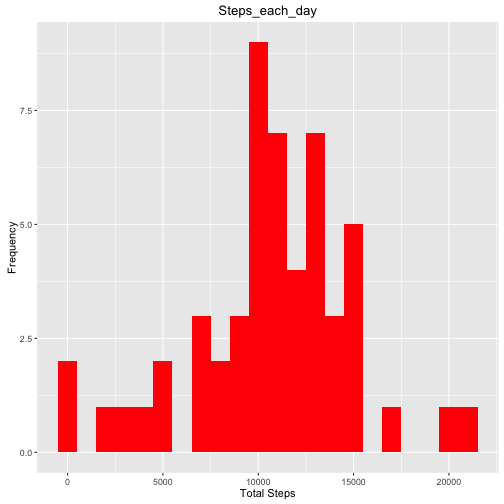
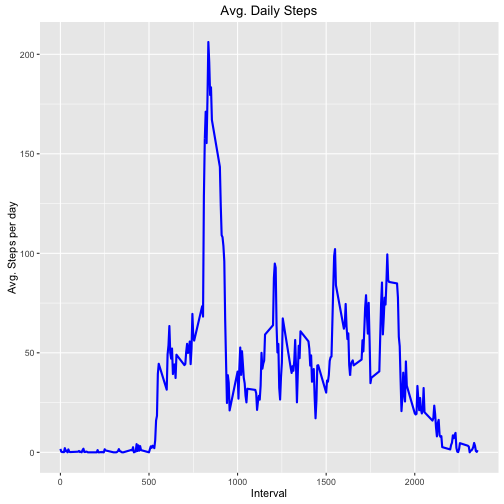
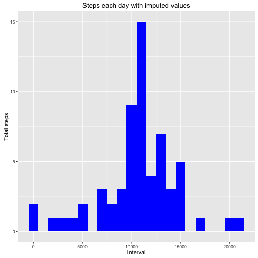
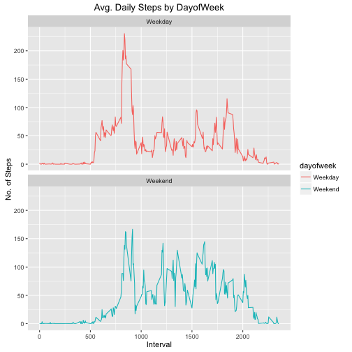

## Loading the data

```r
library(ggplot2)
library(dplyr)
```

```
## 
## Attaching package: 'dplyr'
```

```
## The following objects are masked from 'package:stats':
## 
##     filter, lag
```

```
## The following objects are masked from 'package:base':
## 
##     intersect, setdiff, setequal, union
```

```r
Activity<-read.csv("./data/activity.csv")
Activity$date<- as.Date(Activity$date)
```

## Calculating total steps taken each day and representing them on a Histogram
In the next steps, the data is aggregated by date in order to:

- Calculate the total number of steps taken per day
- Make a histogram of the total number of steps taken each day
- Calculate and report the mean and median of the total number of steps taken per day

```r
Total_Steps_by_day<- Activity%>%
                     group_by(date)%>%
                     filter(!is.na(steps))%>%
                     summarise(steps_each_day = sum(steps, na.rm=TRUE))
Total_Steps_by_day
```

```
## Source: local data frame [53 x 2]
## 
##          date steps_each_day
##        (date)          (int)
## 1  2012-10-02            126
## 2  2012-10-03          11352
## 3  2012-10-04          12116
## 4  2012-10-05          13294
## 5  2012-10-06          15420
## 6  2012-10-07          11015
## 7  2012-10-09          12811
## 8  2012-10-10           9900
## 9  2012-10-11          10304
## 10 2012-10-12          17382
## ..        ...            ...
```


```r
ggplot(Total_Steps_by_day, aes(x = steps_each_day)) +
        geom_histogram(fill = "red", binwidth = 1000) +
        labs(title = "Steps_each_day", x = "Total Steps", y = "Frequency")
```



### mean and median number of steps taken each day

```r
mean(Total_Steps_by_day$steps_each_day)
```

```
## [1] 10766.19
```

```r
median(Total_Steps_by_day$steps_each_day)
```

```
## [1] 10765
```


## Time series plot of average steps taken

```r
Interval <- Activity %>%
           filter(!is.na(steps)) %>%
           group_by(interval) %>%
           summarize(steps = mean(steps))
ggplot(Interval, aes(x =interval , y=steps)) +
        geom_line(color="blue", size=1) +
        labs(title = "Avg. Daily Steps", x = "Interval", y = "Avg. Steps per day")
```



### the 5 minute interval containg the max no of steps

```r
Interval[which.max(Interval$steps), ]
```

```
## Source: local data frame [1 x 2]
## 
##   interval    steps
##      (int)    (dbl)
## 1      835 206.1698
```


## Imputing the missiing data and plotting a Histogram of imputed data
All the not available values are imputed with the average value for that 5 minute interval.

```r
names(Activity)
```

```
## [1] "steps"    "date"     "interval"
```

```r
sum(is.na(Activity[,1]))
```

```
## [1] 2304
```

```r
Activity2<- Activity
missingValue<- is.na(Activity2$steps)
avg_interval<- tapply(Activity2$steps,Activity2$interval, mean, na.rm=TRUE, simplify = TRUE)
Activity2$steps[missingValue] <- avg_interval[as.character(Activity2$interval[missingValue])]
Total_Steps_by_day2<- Activity2%>%
                     group_by(date)%>%
                     summarise(steps_each_day2 = sum(steps, na.rm=TRUE))
ggplot(Total_Steps_by_day2, aes(x = steps_each_day2)) +
        geom_histogram(fill = "blue", binwidth = 1000) +
        labs(title = "Steps each day with imputed values", x = "Interval", y = "Total steps")
```



### mean and median of imputed data 

```r
mean(Total_Steps_by_day2$steps_each_day2)
```

```
## [1] 10766.19
```

```r
median(Total_Steps_by_day2$steps_each_day2)
```

```
## [1] 10766.19
```

The impact of imputing missing data with the average number of steps in the same 5-min interval is that both the mean and the median are same : 10766.19. 

## Plotting Activity patterns of weekdays and weekends

```r
Activity2<- Activity2%>%
        mutate(dayofweek = ifelse(weekdays(Activity2$date)=="Saturday" | weekdays(Activity2$date)=="Sunday", "Weekend", "Weekday"))
Interval2<- Activity2%>%
        group_by(interval, dayofweek)%>%
        summarise(steps2 = mean(steps, na.rm=TRUE))
ggplot(Interval2, aes(x =interval , y=steps2, color=dayofweek)) +  
geom_line() + labs(title = "Avg. Daily Steps by DayofWeek", x = "Interval", y = "No. of Steps") +
facet_wrap(~dayofweek, ncol = 1, nrow=2)
```



During the weekday, the subject is more active earlier in the day but the subject is more active throughout the weekends because the subject is working during the weekdays, hence moving less during the day.
